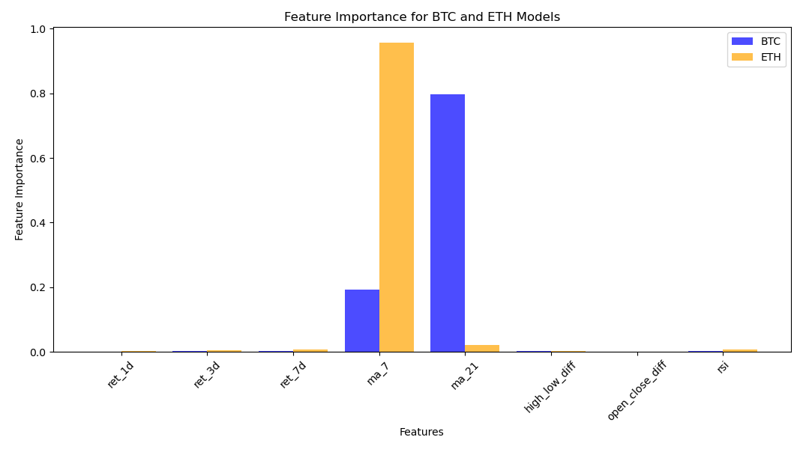
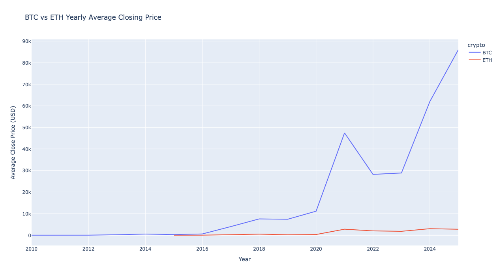

[](https://github.com/claireoh-duke/python_template_706/actions/workflows/ci.yml)

## 📊 Crypto Data Analysis
We hope to predict cryptocurrency prices accurately so we can become millionaires! This project started from that hope. We asked ourselves, Can we predict prices based on historical data?
This project explores Bitcoin (BTC) and Ethereum (ETH) price data through data cleaning, feature engineering, exploratory data analysis (EDA), and machine learning modeling. The goal is to understand price movements, engineer predictive features, and train models to forecast short-term (5-day ahead) closing prices.


## 📂 Project Structure

```plaintext
crypto-data-analysis/
├── BTC.csv               # Bitcoin historical price data
├── ETH.csv               # Ethereum historical price data
├── HW2_Claire Oh.py      # Main .py script
└── README.md             # Project documentation
```

## 🧰 Tech Stack
- **Programming:** `Python 3.12.11`  
- **Libraries:**  
  - `pandas`, `numpy` → Data manipulation & analysis  
  - `matplotlib`, `plotly.express` → Visualization  
  - `scipy` → Outlier detection (Z-score)  
  - `xgboost` → Machine Learning (regression model)  
  - `scikit-learn` → Train/test split, metrics, evaluation

## ⚙️ Setup Instructions (Dev Container)
This project includes a Dev Container setup for reproducible development.

Requirements
[Visual Studio Code](https://code.visualstudio.com)
[Dev Containers extension](https://marketplace.visualstudio.com/items?itemName=ms-vscode-remote.remote-containers)

Steps
1. Open the project root folder in VS Code
2. Press Ctrl+Shift+P → choose Dev Containers: Reopen in Container
3. Wait for the container to build and initialize
4. You are now inside a reproducible dev environment 🎉

## ▶️ Running & Testing
Run Main Script: 
Inside the Dev Container:
```bash
python HW2_Claire\ Oh.py
```

Run Tests: 
```bash
python pytest tests/
```
 
## 🔎 Workflow  
### 1️⃣ **Import & Load Data**  
```text
• Load BTC and ETH CSV files  
• Display first few rows for a quick sanity check
```
### 2️⃣ **Data Cleaning**
```text
• Check for missing values
• Drop duplicates
• Remove outliers using Z-score filtering
```
### 3️⃣ EDA (Exploratory Data Analysis)
```text
• Generate statistical summaries
• Filter data by date & max closing price
• Group data by year to compute yearly average closing prices
```
### 4️⃣ Feature Engineering
```text
• Compute lag returns (1-day, 3-day, 7-day)  
• Calculate moving averages (7-day, 21-day)  
• Create volatility metrics:
    - high_low_diff = high - low
    - open_close_diff = open - close
• Compute RSI (Relative Strength Index) using rolling averages  
• Drop NaN values created during rolling calculations  
```
### 5️⃣ Modeling
```text
• Define feature set: [ret_1d, ret_3d, ret_7d, ma_7, ma_21, high_low_diff, open_close_diff, rsi]  
• Create target variable: close price shifted by 5 days (predict 5 days ahead)  
• Remove NaN from X, y and reset index  
• Split data into train/test sets (time-series split, no shuffling)  
• Train XGBoost Regressor with:
    - n_estimators=500
    - learning_rate=0.05
    - max_depth=4
• Evaluate using:
    - MSE (Mean Squared Error)
    - RMSE
    - R² Score
```
### 6️⃣ Feature Importance
```text
• Extract feature importance from trained XGBoost models  
• Visualize BTC & ETH feature importances side by side with bar chart  
```
### 7️⃣ Interactive Visualization
```text
• Use Plotly Express to create scatter plots (e.g., ma_7 vs close)  
• Add regression trendlines for better interpretation  
• Fully interactive plots for visual exploration  
```

## 📊 Visualization 
### **Feature Importance**  
Usually, we use lag returns, moving averages, and RSI to predict asset prices. It turns out that lag returns have higher importance for prediction.


### **Time Series of Closing Price**
As shown in the plot, BTC exhibited greater volatility in price changes.


### **Price Predicted**
The prediction model for ETH fit the data better than the one for BTC.


## 📍 Conclusion 
Overall, this project demonstrates that while historical data and engineered features can provide reasonable predictive power, cryptocurrency prices remain volatile and challenging to forecast accurately. Future work could explore additional features, alternative modeling approaches, or higher-frequency data to further improve predictions.
We found that the more volatile an asset's price is, the harder it is to predict. For example, BTC exhibited higher volatility than ETH, which made BTC prices more difficult to forecast with our models.
